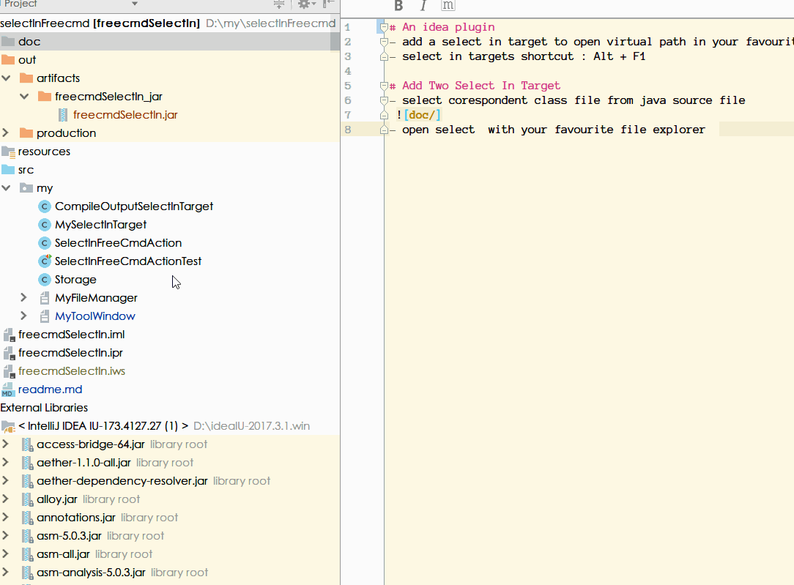
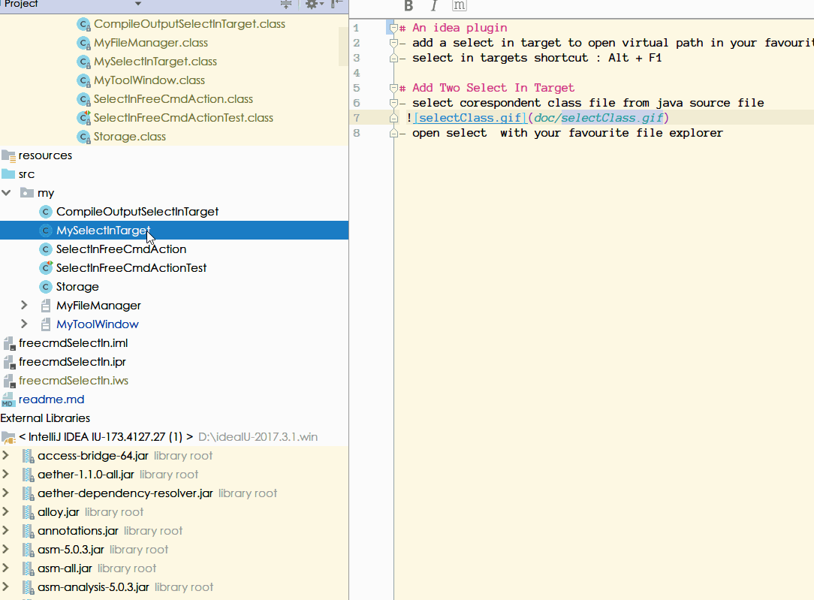
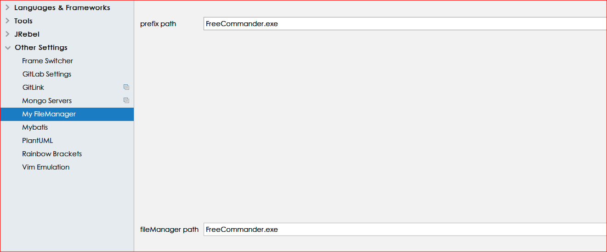
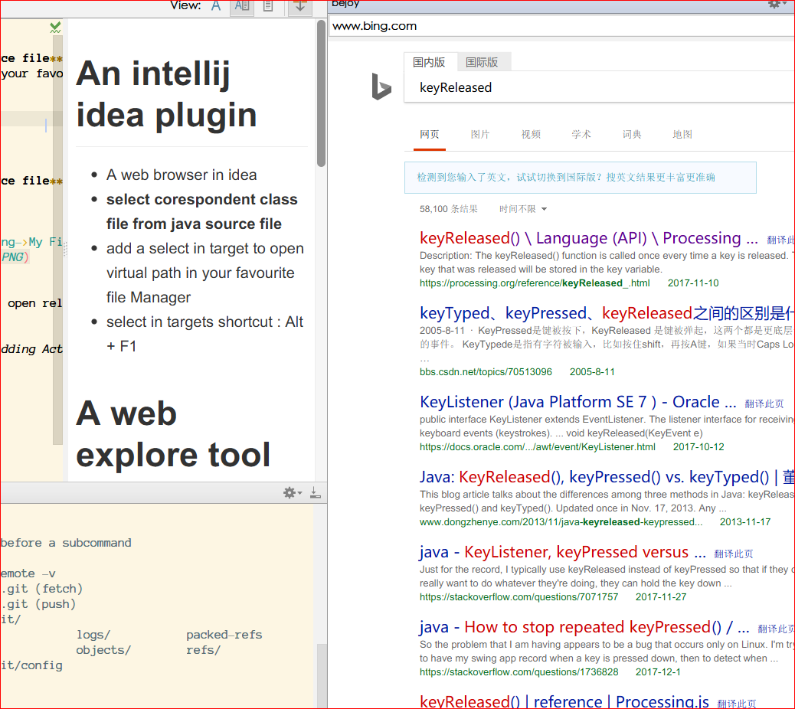

# Add  Select In Target

- **select corespondent class file from java source file**
  
- open select with your favourite file explorer
  

> the file Manager path can be set in Other Setting->My FileManger

# An intellij idea plugin

- A web browser in idea
- select corespondent class file from java source file
- add a select in target to open virtual path in your favourite file Manager
- select in targets shortcut : Alt + F1

# A web explore tool window use javaFx webview

